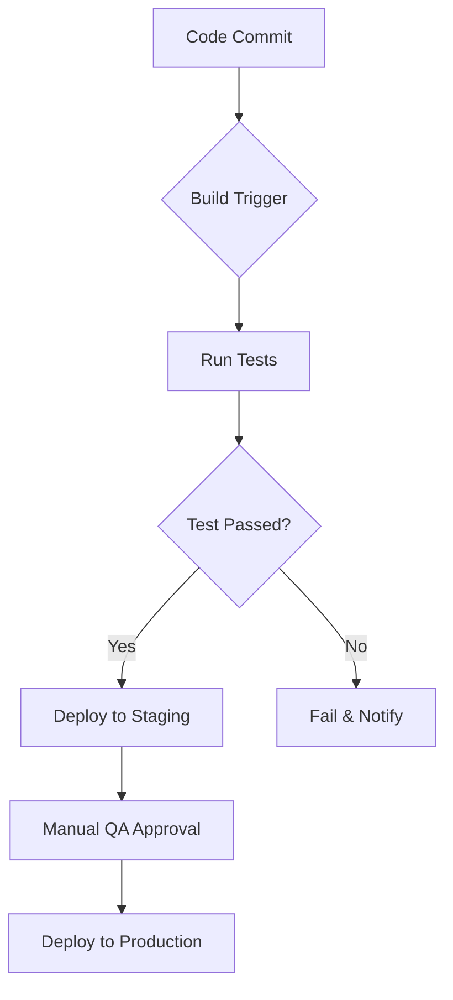

```markdown
# Design & Estimation Document (DE.md)

## 1. Executive Summary

This document outlines the design and estimation for a movie seat booking system based on the approved Requirements Analysis (RA) document. The system enables users to select movies, book seats, calculate costs, and retain selections using local storage. Key functional requirements (FRs) include movie selection (FR-MOVIE-001 to FR-MOVIE-005), seat booking (FR-SEAT-001 to FR-SEAT-005), cost calculation (FR-COST-001 to FR-COST-004), and data persistence (FR-PERSIST-001 to FR-PERSIST-004). Non-functional requirements (NFRs) emphasize data integrity (NFR-SEC-001), performance (NFR-PERF-001), and usability (NFR-USABLE-001). Technical constraints mandate the use of **local storage only** (TC-001) and **no server-side session management** (TC-002).

The system prioritizes **client-side architecture** to meet technical constraints, with a focus on **responsive design**, **data persistence**, and **error handling**. Key challenges include managing concurrent seat bookings (NFR-PERF-003) and ensuring local storage reliability (EC-003). The design integrates modern frontend technologies and follows a phased development approach to balance complexity and deliverability.

---

## 2. System Architecture

### 2.1 Architecture Pattern Justification

The system adopts a **client-side single-page application (SPA)** architecture to meet the technical constraints of local storage and no server-side session management. This pattern ensures:

- **Data persistence**: Local storage is used for user selections (FR-PERSIST-001, FR-PERSIST-002).
- **Real-time updates**: Seat availability and cost calculations are handled client-side (FR-SEAT-002, FR-COST-003).
- **Scalability**: The architecture supports future expansion to server-side features (e.g., payment integration).

### 2.2 ASCII Diagram

```
+---------------------+
|   User Interface    |
| (React/Vue.js)      |
+----------+----------+
           |
           | User Actions
           v
+---------------------+
| Seat Selection Logic|
| (React Components)  |
+----------+----------+
           |
           | Seat Data
           v
+---------------------+
|   Local Storage     |
| (localStorage/IndexedDB) |
+----------+----------+
           |
           | Data Sync
           v
+---------------------+
|   Movie Data        |
| (Static JSON/External) |
+---------------------+
```

### 2.3 Component List

| Component Name         | Description                                                                 | RA Requirements Referenced       |
|------------------------|-----------------------------------------------------------------------------|----------------------------------|
| Movie List Component   | Displays and filters movies (FR-MOVIE-001, FR-MOVIE-003, FR-MOVIE-004)     | FR-MOVIE-001, FR-MOVIE-003       |
| Seat Grid Component    | Renders seat availability and handles selection (FR-SEAT-001, FR-SEAT-002) | FR-SEAT-001, FR-SEAT-002         |
| Cost Calculator Module | Computes total cost with taxes/fees (FR-COST-001, FR-COST-002)             | FR-COST-001, FR-COST-002         |
| Local Storage Manager  | Saves/loads user selections (FR-PERSIST-001, FR-PERSIST-002)               | FR-PERSIST-001, FR-PERSIST-002   |
| Error Handler Module   | Manages edge cases (EC-001, EC-002, EC-003)                                | EC-001, EC-002, EC-003           |

---

## 3. Technology Stack

### 3.1 Frontend

| Tool/Language | Version | Justification                                                                 |
|---------------|---------|-------------------------------------------------------------------------------|
| React.js      | 18.x    | Enables reusable components and real-time UI updates (FR-SEAT-002, FR-COST-003) |
| TypeScript    | 4.9     | Ensures type safety and maintainability (NFR-MNT-001)                        |
| Bootstrap     | 5.3     | Provides responsive design and accessibility (NFR-USABLE-001)                |
| Axios         | 1.5     | Handles external data fetching (e.g., movie details)                          |

### 3.2 Backend

| Tool/Language | Version | Justification                                                                 |
|---------------|---------|-------------------------------------------------------------------------------|
| None          | -       | No backend required per technical constraints (TC-002)                       |

### 3.3 Database

| Table Name         | Version | Justification                                                                 |
|--------------------|---------|-------------------------------------------------------------------------------|
| `movies`           | 1.0     | Stores static movie data (FR-MOVIE-001, FR-MOVIE-004)                         |
| `user_selections`  | 1.0     | Persistent data for seat selections and movie choices (FR-PERSIST-001, FR-PERSIST-002) |
| `seat_availability`| 1.0     | Temporarily tracks seat status during a session (FR-SEAT-003)                 |

---

## 4. Infrastructure & Deployment

### 4.1 Cloud Services

| Service          | Purpose                           | Justification                                      |
|------------------|-----------------------------------|----------------------------------------------------|
| Netlify          | Static site hosting               | Easy deployment and CI/CD integration              |
| GitHub Actions   | CI/CD pipeline                    | Automates testing and deployment                   |
| AWS S3           | Backup for critical data (optional)| Ensures redundancy for user selections (NFR-SEC-001) |

### 4.2 CI/CD Pipeline



### 4.3 Environments

| Environment | Description                          | RA Requirements Referenced       |
|-------------|--------------------------------------|----------------------------------|
| Development | For daily testing and debugging      | FR-MOVIE-001, FR-SEAT-001        |
| Staging     | Pre-production validation            | NFR-PERF-001, NFR-USABLE-002     |
| Production  | Live user access                     | All FRs and NFRs                 |

---

## 5. Data Flows for Key Use Cases

### 5.1 Use Case: Select Movie (UC-001)

1. **User** interacts with the **Movie List Component**.
2. **Movie List Component** fetches data from `movies` table (static JSON).
3. **User** applies filters/search (FR-MOVIE-003, FR-MOVIE-002).
4. **Movie List Component** updates UI with filtered results.

### 5.2 Use Case: Book Seats (UC-002)

1. **User** selects a movie, triggering the **Seat Grid Component**.
2. **Seat Grid Component** loads `seat_availability` data.
3. **User** clicks seats, which are validated against `seat_availability` (FR-SEAT-003).
4. **Seat Selection Logic** updates local storage (FR-PERSIST-001).

### 5.3 Use Case: Retain Selections (UC-004)

1. **Local Storage Manager** saves `user_selections` on each change (FR-PERSIST-001).
2. **User** reloads the page.
3. **Local Storage Manager** retrieves `user_selections` and restores UI state (FR-PERSIST-002).

---

## 6. Database Schema Overview

### 6.1 Tables

| Table Name         | Fields                                                                 | Version | Justification                                      |
|--------------------|------------------------------------------------------------------------|---------|----------------------------------------------------|
| `movies`           | `id`, `title`, `genre`, `showtime`, `plot`, `cast`, `runtime`           | 1.0     | Centralized movie data (FR-MOVIE-001, FR-MOVIE-004) |
| `user_selections`  | `movie_id`, `selected_seats`, `timestamp`                              | 1.0     | Persists user data (FR-PERSIST-001, FR-PERSIST-002) |
| `seat_availability`| `movie_id`, `seat_id`, `status` (available/booked)                     | 1.0     | Tracks real-time seat status (FR-SEAT-003)         |

---

## 7. API Surface Overview

| API Endpoint      | Method | Description                                | RA Requirements Referenced       |
|-------------------|--------|--------------------------------------------|----------------------------------|
| `/api/movies`     | GET    | Fetches movie data (static JSON)           | FR-MOVIE-001, FR-MOVIE-004       |
| `/api/seats`      | GET    | Retrieves seat availability                | FR-SEAT-001, FR-SEAT-003         |
| `/api/save`       | POST   | Saves user selections to local storage     | FR-PERSIST-001                   |
| `/api/load`       | GET    | Loads saved selections from local storage  | FR-PERSIST-002                   |

---

## 8. Development Effort Estimation

### 8.1 Module T-Shirt Sizing

| Module               | Size | Effort (Person-Days) | Justification                                      |
|----------------------|------|-----------------------|----------------------------------------------------|
| Movie Selection      | L    | 10                    | Requires complex filtering and UI (FR-MOVIE-001)   |
| Seat Booking         | XL   | 15                    | High interaction and validation (FR-SEAT-001)      |
| Cost Calculation     | M    | 6                     | Simple math with tax/fee logic (FR-COST-001)       |
| Data Persistence     | M    | 5                     | Local storage integration (FR-PERSIST-001)         |

### 8.2 Phased Delivery

| Phase | Features                                 | Duration | Team Size |
|-------|------------------------------------------|----------|-----------|
| 1     | Core UI, Movie Selection, Seat Grid      | 2 weeks  | 2 devs    |
| 2     | Cost Calculation, Local Storage          | 1 week   | 2 devs    |
| 3     | Edge Case Handling, Testing              | 1 week   | 2 devs    |

### 8.3 Team Composition

| Role           | Quantity | Responsibilities                                 |
|----------------|----------|--------------------------------------------------|
| Frontend Dev   | 2        | UI/UX, component logic, local storage            |
| UX Designer    | 1        | Responsive layout, accessibility compliance      |
| QA Engineer    | 1        | Test cases, edge case validation                 |

---

## 9. Technical Risks & Mitigation

| Risk                         | Likelihood | Impact | Mitigation Strategy                                  |
|------------------------------|------------|--------|------------------------------------------------------|
| Local Storage Full (EC-003)  | High       | High   | Monitor storage usage, notify users, limit data size |
| Seat Overbooking (EC-002)    | Medium     | High   | Real-time availability checks, disable over-selection |
| UI Confusion (RISK-002)      | High       | Medium | Tooltips, visual cues, accessibility testing         |

---

## 10. Security Architecture

- **Data Integrity**: Local storage data is validated before saving (NFR-SEC-001).
- **Access Control**: No direct user access to local storage; all interactions are via the application (NFR-SEC-002).
- **Encryption**: Not implemented due to technical constraints but recommended for future phases.

---

## 11. Monitoring & Observability

| Tool             | Purpose                        | RA Requirements Referenced       |
|------------------|--------------------------------|----------------------------------|
| Console Logs     | Debugging UI interactions      | FR-SEAT-002, FR-COST-003         |
| Error Tracking   | Monitor crashes and failures   | NFR-MNT-002                      |
| Storage Monitoring | Alert users on full storage   | FR-PERSIST-004                   |

---

## 12. Cost Estimation

| Category             | Monthly Cost (USD) | Justification                                      |
|----------------------|--------------------|----------------------------------------------------|
| Developer Salaries   | $10,000            | 2 developers at $5,000/month                      |
| Hosting (Netlify)    | $20                | Basic plan for static site hosting                |
| CI/CD (GitHub Actions)| $0                 | Free tier for automation                          |
| Testing Tools        | $50                | UX and performance testing tools                  |
| **Total**            | **$10,070**        |                                                    |

---

## 13. Recommendations & Next Steps

1. **Future Phases**: Add payment gateway integration (GAP-001) and server-side session management (GAP-002).
2. **Performance Optimization**: Implement lazy loading for large movie lists.
3. **Accessibility Testing**: Validate WCAG 2.1 AA compliance for screen readers.
4. **User Education**: Provide tooltips for seat selection and cost calculation.

---

## 14. Traceability Matrix

| Requirement ID | Source       | Type         | Test Case ID        |
|----------------|--------------|--------------|---------------------|
| FR-MOVIE-001   | User Story   | Functional   | TC-FR-MOVIE-001     |
| FR-SEAT-003    | User Story   | Functional   | TC-FR-SEAT-003      |
| NFR-SEC-001    | NFR          | Non-Functional | TC-NFR-SEC-001    |
| TC-001         | Technical Constraint | Constraint | TC-TC-001        |
| EC-001         | Edge Case    | Edge Case    | TC-EC-001           |
```